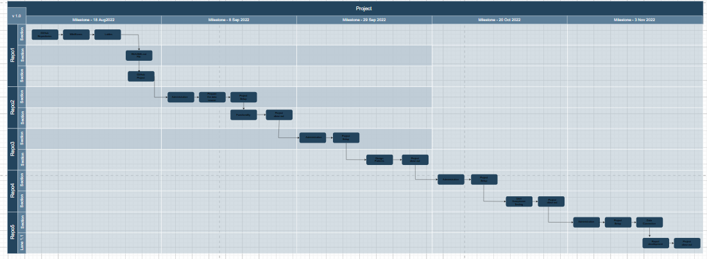
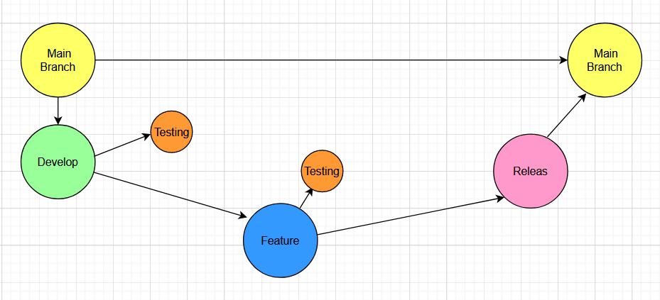

# CMPG-323-Overview-31831680
Project 1

 ## Repository 1: Agile and scrum 
 In this repositorie project 1 , Overview, will be in used and posted on GitHub.com

 ## Repository 2: API development
 For project 2 we hade to create repository on Github. This repo a file that has link to my Azure files.
 The fowllowing links were:
 1. The Database: project2DB
 2. Server: project2db
 3. API Managment Serveice: IoTdata.
 After that the Database with the three requierds tabels were created in SSMS. I also linked the SSMS with my Visual Studio folder with a conncetion string. In the VC file I had to scaffold the database inorder to create controllers for each data base. After words I had to implemented the methods PUT, GET, POST, DELETE  as functionalities for the API. Last stemp I had to do in VC file was Publishing the file in swagger.
 For the Last step it was neccesary to post it onto the cloud and adding security.

 ## Repository 3:Standards and Patterns
 ## CMPG-323-Project-3
In this repository you will find four files such as the .gitignore file, the ConnectedOffice file, The Readme file and, the Reference file.

## .gitIgnore
In this file  you will see which type of file in this project will be ignored by GitHub. These files will not be part of the projects.

## ConnectedOffice
This file contains information and other files needed to create the Web application. In the ConnectedOffice file you will finde the DeviceMannagement_WebApp which contains files needed to create, transfer and implement the data. You will see annother file which is the Visual studio file. All of the coding takes place in this file. The follwing happend in this file:
1. I created 3 interface for all the of the controllers such as the IZones , ICategories and IDevices. In these interfaces the calling of the functionalities ,such as Update, Create, Delete, Getall and Index are created. 
2. After I have created the interfaces I created the repositories for each table. You will see I have created CategoriesRepo, ZonesRepo and DeviceRepo. I linked the repositories with the interfaces to transfer and implement the data. These repositories will have data access operations relating to its controllers.

## Azure.
For the last step, I have published the visual studio file(ConnectedOffice) to Azure under my project2 resourcegroup. I used Azure web app services for windowa to publish the file with a F1 tier free serveice plan. This allowes me to Host my Web application on Azure. The two files you will see Are The ConnectedOffice App serveices and also a ConnectedOfficeWebApp serveice plan (F1, free).

## Word document: References.
This word doument called references contails URL linked to websites that helped me resolve my problems. I have provided a lis fo them.

### Summery
What you will fined:
1. .gitignore that ignores certan files.
2. ConnectedOffice file which contain all of the files and code needed to create the application.
3. Explonation of what was done on Azure and how it was published.

 ## Repository 4:Testing and RPA
 ## CMPG-Project4-31831680
In this readme file I will add information about how the project works, what its purpose is and what you need to know.

Firstly what we need to know is that the UIPath process is created to automate the process of inserting data into the web application. This makes it faster and easier.

## What you will see.
1. What i did first is I created a sequence called "Read excel data", that reads the data from the excel file.
2. By using the activity called "Read Range" I was able to create a path to the excel file I wanted to use(Connected Office Test Data) and select the specific sheet I wanted to use.
3. After step 2 I used the activity "For each row". I was able to save each "CurrentRow" it ino a variable called "dt_DeviceTable".
4. In the Body of step 3 I added the "Use Application/ Browser" to acces the Web application we have created.
5. Inside the browser activity I added the path to the Web application, a sequence called "Create new device/zone/category".
6. In this sequence I added the neccesary input fields, the dropbox fields, checkbox activity, click activity to create a new device, zone or category.

## How it works.
When running the program it will automaticly create new devices, zones and even categories by imputting the values into the neccesarry fields and clicking the button. This is all done on its own without the user doing anything.

## To do list.
1. referencing the datatable into the "Typ into" activity.
2. Adding dropboxes to the the device list.

## Repository 5: Reporting and Monitoring
 All information relevant to Rpoting and Monitouring will be stored in this repositorie.
 
 ## Diagram:
 In the Diagram below you will find the project, repositories, repositories milstones and what needs to be completed in the repositories.
 The project will be completed after each repository. As you can see the flow of completing the project will start from repo 1 the repo 2 until repo 5. By  deconstructing the project into 5 repositories it makes it easier to follow the process of competing the project, but as well making sure what needs to be done first inorder to finish succesful.
 
 
 ## Branch strategy.
 In the diagram below you can see a visual picture of what my strategy is. For each repo I will have a Main branch, developing branc, feature branch and a realese branch. How  it will work iseach repository will first start with the developing brach where the develop start and the the develop will be tested in the  testing branch. The feature branch will be made if a specifake feature needs to be focused on with in the development branch. Thie feature branch will also be tested to make sure every thing works correctly. After all of the branches has been completed they will be merged with the realse branch to make sure every thing works together and then the release branch wil merge back with the main branch.
 
 
 ## .gitignore
 I know that a .gitignore is used so that github can ignore some of the files. This means each repository that contains files that not needs te be track of wil be linked with a .gitignore file to be ignored. For an example the image folder in the Overview repo does not need to be track, because it is just a storage folrder for images.

## Storage of credentials and sensitive information
What I have planed sofar for protecting the storage and sensitive information is to create authorisation. This means that only certain people will have acces to the information with a login interface, by entering a security password and user name.
